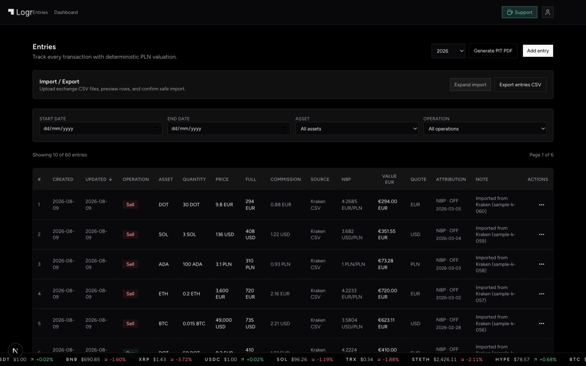
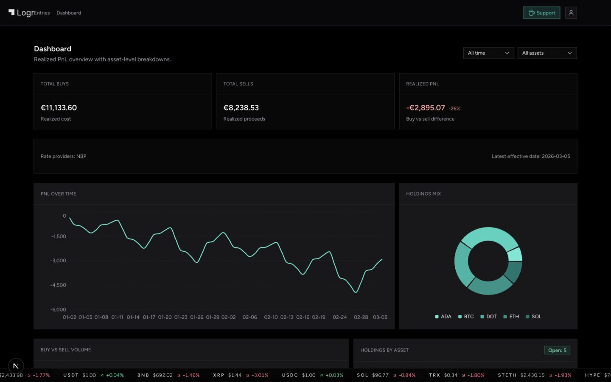
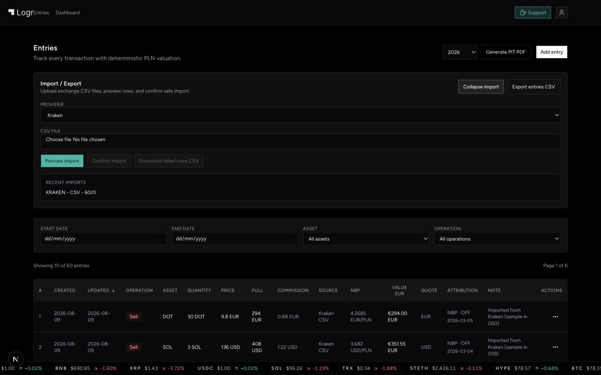

<p align="center">
  
</p>

<p align="center">
  <strong>A private, deterministic crypto transaction journal for PLN accounting.</strong>
  <br />
  Track buys and sells, preserve official rate attribution, and prepare export-ready records—without trading noise.
</p>

<p align="center">
  <a href="LICENSE"></a>
  <a href="https://nextjs.org/"></a>
  <a href="https://www.typescriptlang.org/"></a>
  <a href="package.json"></a>
  <a href="package.json"></a>
</p>

<p align="center">
  <a href="#screenshots">Screenshots</a> ·
  <a href="#features">Features</a> ·
  <a href="#quick-start">Quick start</a> ·
  <a href="docs/production-deployment.md">Deploy</a> ·
  <a href="docs/security-runbook.md">Security</a>
</p>

---

Logr treats every transaction as an accounting record. Calculations are reproducible,
currency conversion retains its source and effective date, and sensitive entry data is
encrypted before it reaches the database. It is built for journaling and tax preparation—not
trading, custody, portfolio advice, or investment recommendations.

## Screenshots

### Transaction journal

Filter, inspect, add, import, and export records from one dense but readable workspace.



### Realized PnL dashboard

Review realized cost, proceeds, PnL over time, and asset-level holdings from the same
deterministic journal data.



<details>
  <summary><strong>CSV import workflow</strong></summary>

Preview supported exchange exports before confirming an import, with recent batch status
visible alongside the journal.


</details>

> Screenshots use seeded sample transactions. Values are illustrative.

## Features

- **Deterministic accounting** — consistent buy, sell, commission, and realized PnL rules.
- **Official FX attribution** — PLN valuation through NBP rates with the provider, effective
  date, and publication status retained on each record.
- **Encrypted journal data** — AES-256-GCM entry encryption with per-user data-encryption
  keys wrapped by `ENTRY_KEK`.
- **Safe exchange imports** — preview-and-confirm CSV workflows for Kraken and Binance,
  including duplicate protection and failed-row export.
- **Useful exports** — full journal CSV export plus year-specific PIT PDF generation.
- **Focused analytics** — realized PnL history, buy/sell volume, holdings mix, and asset
  breakdowns.
- **International UI** — English and Polish copy with locale-aware dates and numbers.
- **Private-by-default operations** — OAuth authentication, gated public registration,
  rate limiting, Turnstile support, audit logging, and hard account deletion.

## How valuation works

For each transaction, Logr stores the original quote amount and derives an accounting value
from an attributable exchange rate:

```text
full price = quantity × unit price
PLN value  = full price × NBP quote/PLN rate
```

- PLN quotes use a rate of `1`.
- Foreign-currency rates resolve to the appropriate NBP publication.
- Missing publication days are handled by stepping back to the latest available rate.
- Dashboard and export calculations operate on the same persisted journal records.

## Tech stack

| Layer | Technology |
| --- | --- |
| Application | Next.js 16 App Router, React 19, TypeScript |
| UI | Tailwind CSS, Base UI, Recharts |
| Database | PostgreSQL on Neon, Drizzle ORM |
| Authentication | NextAuth with Google and GitHub OAuth |
| Validation | Zod |
| Abuse protection | Upstash Redis rate limiting, Cloudflare Turnstile |
| Testing | Vitest, Testing Library, jsdom |

## Quick start

### Prerequisites

- Node.js 20 or newer
- pnpm 9 or newer
- A PostgreSQL database
- Google and/or GitHub OAuth credentials

### Run locally

```bash
git clone https://github.com/wrobit/logr-transaction-journal.git
cd logr-transaction-journal
pnpm install
cp .env.example .env.local
```

Configure `.env.local`, then apply migrations and start the app:

```bash
pnpm db:migrate
pnpm dev
```

Open [http://localhost:2206](http://localhost:2206).

Public signup is disabled in the example configuration. Keep
`PUBLIC_REGISTRATION_ENABLED=false` until OAuth, recovery, monitoring, rate limiting, and
production smoke tests are ready.

## Configuration

The complete variable list and safe placeholders live in [`.env.example`](.env.example).
The essential groups are:

| Group | Variables |
| --- | --- |
| Database | `DATABASE_URL`, `MIGRATION_DATABASE_URL`, `DATABASE_POOL_MAX` |
| Auth | `NEXTAUTH_URL`, `NEXTAUTH_SECRET`, OAuth provider credentials |
| Encryption | `ENTRY_KEK` |
| Public URLs | `NEXT_PUBLIC_SITE_URL`, optional support and analytics URLs |
| Registration | `PUBLIC_REGISTRATION_ENABLED`, Upstash and Turnstile credentials |
| Administration | `ADMIN_EMAIL_ALLOWLIST` |

Never expose `MIGRATION_DATABASE_URL` to the application runtime or commit `.env*` files.
Losing `ENTRY_KEK` without a recovery path makes encrypted records unreadable.

## Development commands

| Command | Purpose |
| --- | --- |
| `pnpm dev` | Run the development server on port `2206` |
| `pnpm build` | Create a production build |
| `pnpm test` | Run the Vitest suite |
| `pnpm lint` | Run ESLint |
| `pnpm type:check` | Run strict TypeScript checks |
| `pnpm i18n:check` | Verify English and Polish locale-key parity |
| `pnpm db:generate` | Generate a Drizzle migration |
| `pnpm db:migrate` | Apply pending migrations |
| `pnpm db:studio` | Open Drizzle Studio |

For broad changes, run:

```bash
pnpm lint
pnpm type:check
pnpm i18n:check
pnpm test
pnpm build
```

## Project structure

```text
app/          routes, layouts, auth, admin, and API handlers
actions/      server-side mutation workflows
components/   feature and shared UI components
lib/          domain logic, encryption, auth, database, NBP, exports
messages/     English and Polish translations
drizzle/      generated database migrations
test/         Vitest suites and fixtures
docs/         deployment, security, and i18n guidance
public/       brand assets, samples, and product screenshots
```

## Security and deployment

Production readiness depends on more than a successful build. Before opening registration,
follow the [production deployment checklist](docs/production-deployment.md), trial destructive
migrations on an isolated database branch, and validate backup/restore and monitoring.

Encryption key handling and recovery procedures are documented in the
[security runbook](docs/security-runbook.md). Please report suspected vulnerabilities
privately to [piotr.wrobel@quadrantive.com](mailto:piotr.wrobel@quadrantive.com).

## Contributing

Contributions are welcome. For a larger change, open an issue or short proposal first so the
scope stays aligned with Logr's deliberately minimal product direction.

High-value contributions include reproducible bug fixes, financial-calculation tests, import
fixtures, accessibility improvements, and focused documentation updates.

## Support

Logr is free, open source, and community-supported. If it saves you time, you can support
maintenance through [Buy Me a Coffee](https://buymeacoffee.com/wrobit/e/513107).

## License

Released under the [MIT License](LICENSE).

---

<p align="center">Built carefully for clear records, reproducible calculations, and fewer spreadsheet surprises.</p>
